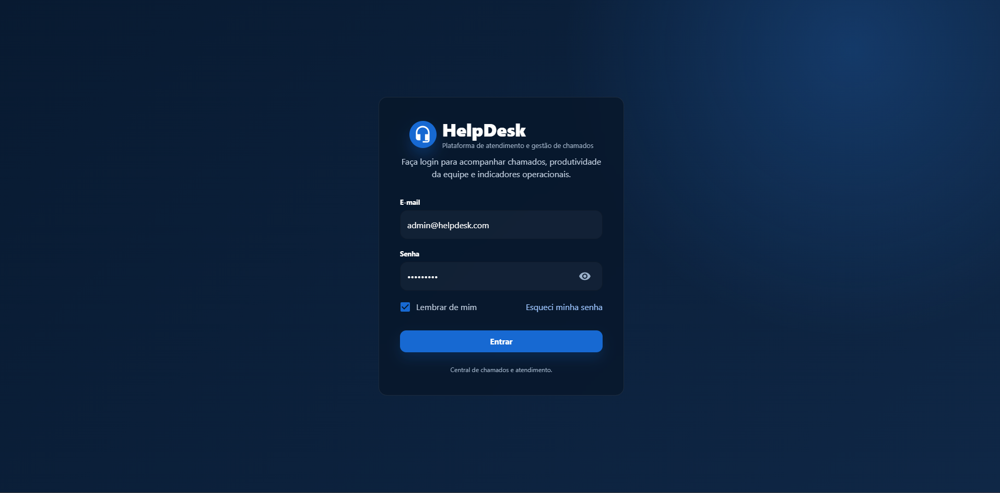
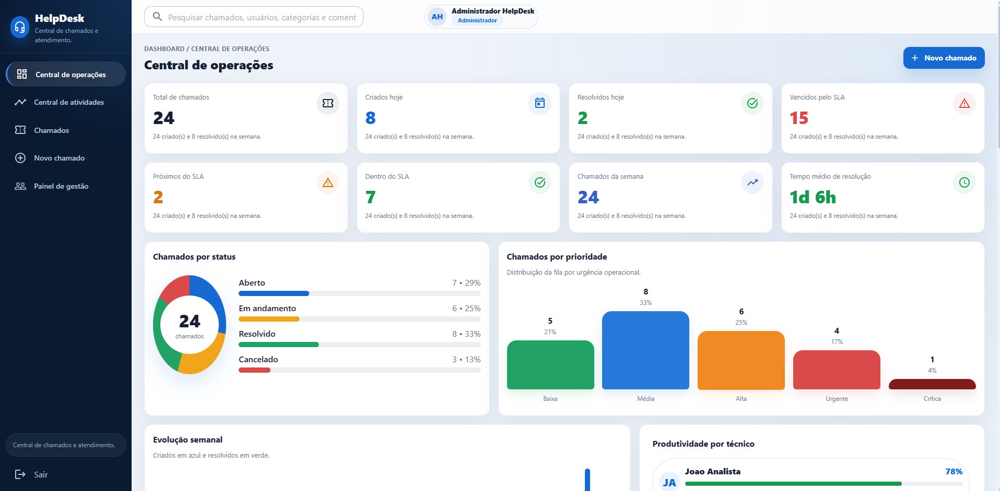
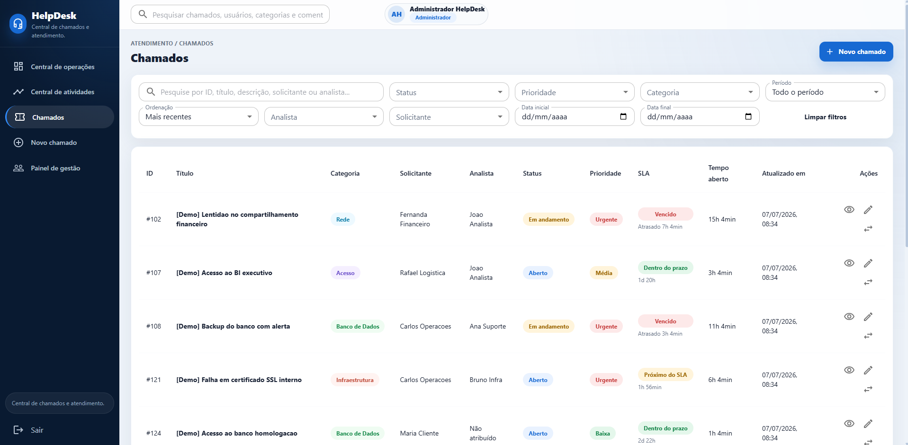

# 🎧 Sistema HelpDesk

Sistema Full Stack de gerenciamento de chamados desenvolvido para simular uma plataforma profissional de suporte técnico, permitindo abertura, acompanhamento e gerenciamento de tickets por diferentes perfis de usuário.

## 🚀 Tecnologias

### Front-end
- React
- TypeScript
- Material UI

### Back-end
- Java
- Spring Boot
- Spring Security
- JWT

### Banco de Dados
- PostgreSQL

### DevOps
- Docker
- Docker Compose
- Nginx

---

## ✨ Funcionalidades

* ✅ Autenticação com JWT
* ✅ Controle de acesso por perfis (Admin, Técnico e Cliente)
* ✅ Dashboard com indicadores
* ✅ Gestão completa de chamados
* ✅ Histórico e comentários dos tickets
* ✅ Gerenciamento de usuários
* ✅ API REST documentada com Swagger
* ✅ Banco versionado com Flyway
* ✅ Containerização com Docker

---

## 📸 Screenshots

<table>
  <tr>
    <td align="center">
      <strong>🔐 Login</strong><br><br>
      
    </td>
  </tr>

  <tr>
    <td align="center">
      <strong>📊 Dashboard</strong><br><br>
      
    </td>
  </tr>

  <tr>
    <td align="center">
      <strong>🎫 Gestão de Chamados</strong><br><br>
      
    </td>
  </tr>
</table>

---

## ⚙️ Executando o projeto

```bash
git clone https://github.com/matheus-samuel-dev/sistema-helpdesk.git

cd sistema-helpdesk

docker compose up --build
```

A aplicação ficará disponível em:

* **Front-end:** `http://localhost:5174`
* **API:** `http://localhost:8080`
* **Swagger:** `http://localhost:8080/swagger-ui.html`

---

## 📚 O que este projeto demonstra

* Arquitetura Full Stack
* APIs REST
* Autenticação JWT
* Controle de permissões
* Integração React + Spring Boot
* PostgreSQL
* Docker
* Flyway
* Boas práticas de organização de código

---

## 👨‍💻 Autor

**Matheus Samuel**

* 💼 LinkedIn: https://linkedin.com/in/matheus-samuel-dev
* 💻 GitHub: https://github.com/matheus-samuel-dev
* 🌐 Portfólio: https://matheus-samuel-dev.github.io/Portfolio/
